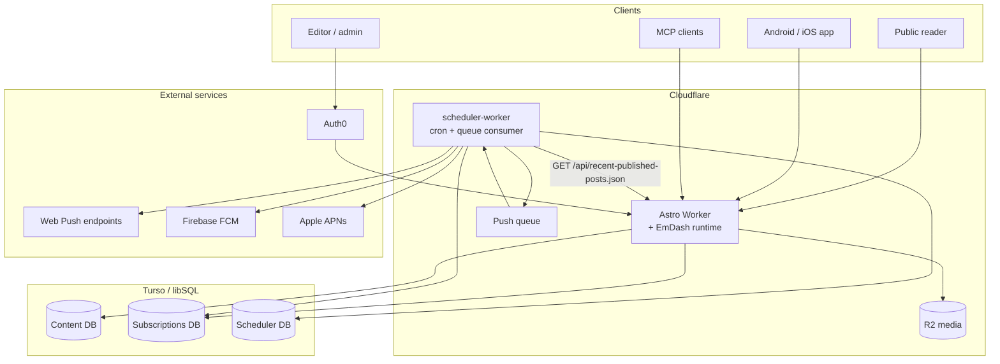
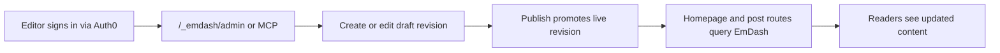
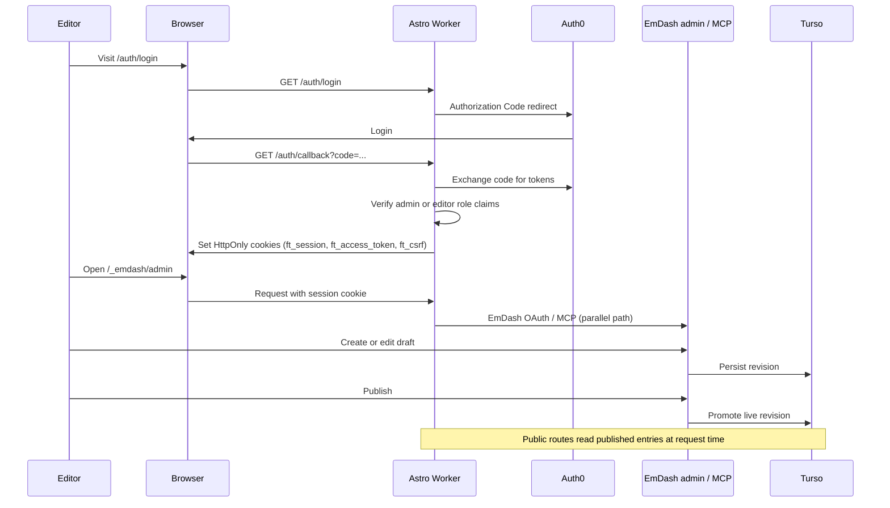
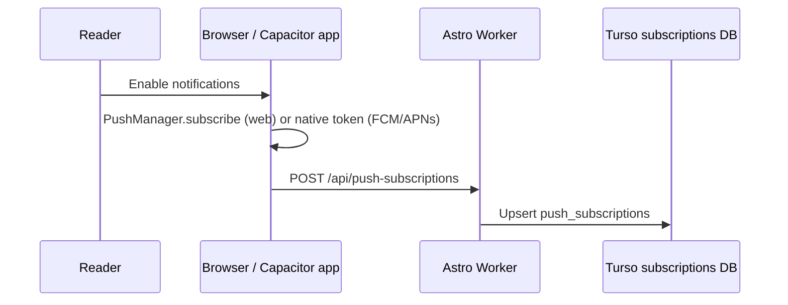
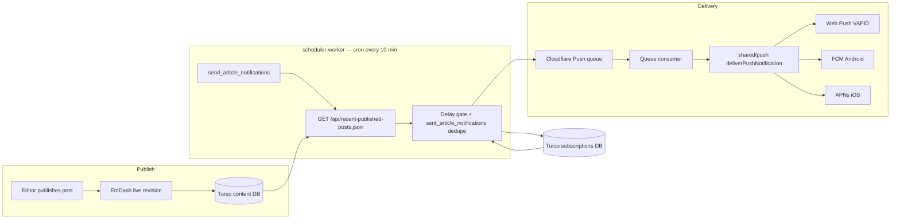
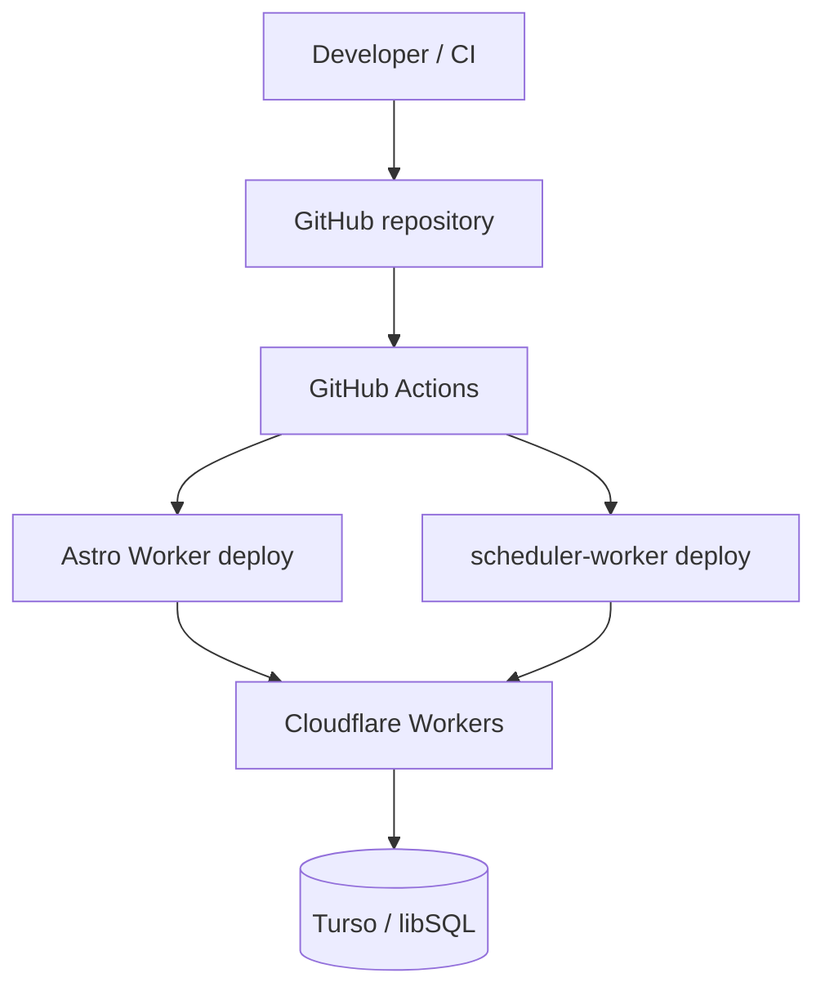

# Freedom Times — Architecture

> **Status:** Living document aligned with the production stack  
> **See also:** [README.md](README.md) for the documentation hub and quick links

---

## 1. Product Overview

Freedom Times is a UK/Europe-focused news platform for cult survivors. It vets stories and routes them as exclusives to established journalists. The two primary user groups are:

| Group | Need |
|---|---|
| **Public visitors** | Fast, readable, accessible news stories; optional browser or native push alerts for new articles |
| **Admin editors** | Secure ability to create, edit, publish and delete stories |

---

## 2. Key Non-Functional Requirements

| Requirement | Notes |
|---|---|
| **Core Web Vitals / LCP** | Server-rendered HTML on first request; minimal JS shipped to the browser |
| **SEO** | Full SSR; pages must be crawlable without executing JavaScript |
| **Hosting** | Cloudflare Workers (not Pages) for full programmatic control; Workers can still serve static Assets |
| **PWA / App** | Web-first delivery with optional Android/iOS packaging via Capacitor; requires HTTPS, Web App Manifest, and Service Worker support |
| **Push notifications** | Browser Web Push (VAPID) plus native Android (FCM) and iOS (APNs) via Capacitor; no email newsletter |
| **Infrastructure as Code** | All cloud resources (Cloudflare, Auth0, Turso) are defined in source-controlled declarative files and deployed via CI/CD; no manual portal drift |
| **Privacy / GDPR** | Reader commitments in [/privacy-policy](https://freedomtimes.news/privacy-policy); minimum data collection; no reader profiling or advertising use |

---

## 3. System Context

The platform runs on Cloudflare Workers with three Turso databases (content, subscriptions, scheduler), Auth0 for editorial auth, and a separate `scheduler-worker` for cron-driven push delivery.



Readers get server-rendered pages from the Astro Worker. Editors sign in through Auth0 on the same origin. Published content lives in EmDash on Turso; media in R2. Push subscriptions are stored in a dedicated Turso database. A separate scheduler Worker polls for newly published articles and delivers notifications through a Cloudflare Queue and the shared `shared/push` delivery module.

---

## 4. Component Breakdown

### 4.1 Cloudflare Workers — Astro App + EmDash Runtime

**Role:** Receives every HTTP request from both public readers and authenticated editors, serves the Astro site, and hosts the EmDash admin, OAuth, and MCP endpoints inside the same Worker deployment.

**Framework:** [Astro](https://astro.build/) with the [`@astrojs/cloudflare` adapter](https://docs.astro.build/en/guides/integrations-guide/cloudflare/).

- Astro's **Islands architecture** ships zero JS to the browser by default — a good fit for a content-heavy publication.
- The live site and CMS share one deployment artifact rather than maintaining separate public and editorial backends.
- Astro runs natively on the Cloudflare Workers runtime, and the app integrates EmDash directly through the `emdash/astro` integration.
- Public pages query EmDash collections directly at request time using helpers such as `getEmDashCollection('posts', { status: 'published' })` and `getEmDashEntry('posts', slug)`.

**Current integration shape:**

```ts
emdash({
  mcp: true,
  database: {
    type: 'sqlite',
    entrypoint: '<libsql shim>',
    config: {
      url: process.env.TURSO_DATABASE_URL,
      authToken: process.env.TURSO_AUTH_TOKEN,
    },
  },
  storage: r2({ binding: 'MEDIA' }),
})
```

Published content is served from the CMS-backed data model directly — there is no separate story projection layer.

---

### 4.2 EmDash — CMS, Content Store, and Published Reads

EmDash is the content-management system for Freedom Times.

What that means in practice:

- Content lives in EmDash-managed collections, with revision history stored in the backing database.
- Editors work in the EmDash admin under `/_emdash/admin`.
- External editorial tooling can talk to the same CMS via the EmDash MCP endpoint under `/_emdash/api/mcp`.
- The live site reads published entries directly from EmDash.
- The homepage lists the latest published posts with `getEmDashCollection('posts', { status: 'published', orderBy: { published_at: 'desc', updated_at: 'desc' } })`.
- Post pages resolve individual entries with `getEmDashEntry('posts', slug)` and render stored content through a shared EmDash-aware content view.

---

### 4.3 Turso / libSQL — Canonical Content Database

EmDash is backed by Turso/libSQL as the canonical content store.

Current characteristics:

- The Worker uses the libSQL client via a compatibility shim suitable for Cloudflare Workers.
- EmDash stores collection data and revision state in database tables.
- Draft and published state are managed inside EmDash's own content lifecycle.
- The site depends on database-backed reads being consistent with EmDash's notion of live content.

This is the effective source of truth for stories, metadata, and revision history. Separate Turso databases hold push subscription records and scheduler job state (see §4.9).

---

### 4.4 Cloudflare R2 — Media Storage

EmDash media storage is wired to Cloudflare R2 using `@emdash-cms/cloudflare`.

Stores:

- uploaded images and other CMS-managed media assets
- featured images referenced by homepage and post views
- media library assets reused across entries

R2 integrates cleanly with the Worker runtime and matches the current EmDash storage adapter.

---

### 4.5 EmDash OAuth, MCP, and Publish Lifecycle

EmDash is not just a data library in this app; it is the editorial control plane.



Important current details:

- Middleware explicitly keeps `/_emdash/*` and related OAuth discovery paths outside the outer Auth0 gate so EmDash can complete its own OAuth and MCP flows.
- The Worker normalizes some OAuth query parameters for EmDash clients and exposes compatibility redirects for `.well-known` metadata routes.
- The build includes a small post-build patch step that improves EmDash publish diagnostics in Workers and guards against a known publish-time schema drift problem while upstream behavior is being validated.
- Public rendering is driven by EmDash's published/live state.

---

### 4.6 Auth0 — Authentication & RBAC

Auth0 handles login for **editors and admins only** — public readers do not authenticate and do not receive Auth0 cookies. The web app uses Authorization Code flow and stores tokens in secure HttpOnly cookies; browser JavaScript does not read bearer tokens directly.

**Roles:**

| Role | Permissions |
|---|---|
| `editor` | Create and update own stories; upload media |
| `admin` | All editor permissions + delete stories + manage push subscribers |

The Cloudflare Worker also validates tokens for any protected admin routes served within the same origin (e.g., `/admin/*`). This allows the progressive Admin UI to be progressively revealed within the same Astro application without a separate admin domain.

Consent and scope notes:

- Login requests minimal identity scope (`openid`) plus the configured API audience for role/permission-aware API access.
- First-party consent prompts are disabled on the Auth0 API resource server (`skip_consent_for_verifiable_first_party_clients = true`) so normal login does not require a separate consent click-through.

#### Request and auth flow



**Discussion point:** Hosting the admin UI within the same Workers origin (progressive enhancement) vs a separate subdomain (`admin.freedomtimes.com`). The same-origin approach gives a single deployment artefact and avoids CORS issues between admin UI and API. The trade-off is that the Worker needs to handle JWT validation.

---

### 4.7 Progressive Admin UI

The Admin UI is a set of **Astro islands** (or React components) that are conditionally rendered when the Worker detects a valid admin JWT in the request (e.g., in a cookie set after Auth0 login). This avoids shipping any admin UI code to unauthenticated visitors.

Admin surfaces:

- Story list view (drafts + published)
- Story create/edit form (rich text body editor)
- Canonical media library with search, upload, reuse, and canonical name-based embedding
- Taxonomy-assisted metadata panel for people, groups, and institutions with editor confirmation
- Publish / Unpublish / Delete controls
- Push subscriber list (read-only count + export)

---

### 4.8 PWA, Service Worker & Capacitor

1. **Web App Manifest** (`manifest.webmanifest`): name, icons, `display: standalone`, `theme_color` matching the Times-inspired palette.
2. **Service Worker**: pre-cache the shell (header, footer, fonts, CSS). Use a Stale-While-Revalidate strategy for story pages so they remain readable offline.
3. **Capacitor**: packages the existing web app for Android and iOS while preserving a single web-first codebase. Native plugins handle push token registration, deep linking, splash screens, and other device capabilities that are awkward or unavailable in the browser alone.

For app notifications specifically, category preferences, mute settings, or similar reader choices should be persisted in on-device storage and applied client-side where feasible. The server should only know the minimum required delivery subscription details, not a rich per-reader notification preference profile.

Push delivery architecture is documented in §4.9. Operator testing: [web/docs/PUSH_NOTIFICATIONS_TEST_PLAN.md](web/docs/PUSH_NOTIFICATIONS_TEST_PLAN.md).

---

### 4.9 Push Notifications & scheduler-worker

Freedom Times alerts readers through **browser and native push notifications**, not email. There is no newsletter or email digest.

#### Subscribe path

Readers opt in from the site or packaged app. The Astro Worker persists technical subscription objects in Turso (`push_subscriptions`).



- **Web:** `PushManager.subscribe` with the public VAPID key (`PUSH_SUBSCRIBE_PUBLIC_KEY` on the Worker).
- **Android / iOS:** Capacitor registers a native device token; the same API stores `{ platform, token }` payloads.
- Only pseudonymous delivery metadata is stored server-side: a server-generated random UUID (`id`), opaque browser push endpoint or native device token, optional locale, and user-agent. No names, email addresses, or other personally identifiable data — subscriptions cannot be traced back to an individual reader. See [/privacy-policy](https://freedomtimes.news/privacy-policy) and §4.13.
- **Consent:** Opt-in is the browser or OS notification permission prompt; see [web/docs/PUSH_NOTIFICATIONS_TEST_PLAN.md](web/docs/PUSH_NOTIFICATIONS_TEST_PLAN.md) and [web/docs/PUSH_NOTIFICATIONS_OPERATOR.md](web/docs/PUSH_NOTIFICATIONS_OPERATOR.md).

#### Publish → notification pipeline

Publishing in EmDash does **not** send push messages synchronously. A separate `scheduler-worker` Cloudflare Worker runs on a cron schedule, polls a recent-posts feed, and queues delivery.



**Pipeline steps:**

1. **Cron tick** (`*/10 * * * *`): `scheduler-worker` claims due rows from `scheduler_jobs` in the scheduler Turso database. The seeded job `send_article_notifications` runs every 10 minutes.
2. **Recent-posts feed:** The scheduler fetches `{siteOrigin}/api/recent-published-posts.json` from the Astro Worker. That endpoint returns the latest 25 published EmDash posts with id, slug, title, excerpt, `publishedAt`, and optional image URL.
3. **Delay gate:** `PUBLISH_NOTIFICATION_DELAY_MINUTES` (30 in production, 0 in staging) skips posts published too recently so editors can correct typos before alerts go out.
4. **Dedupe:** `sent_article_notifications` in the subscriptions database prevents re-sending for the same article id.
5. **Queue:** For each eligible article, the scheduler enqueues one message per active subscription onto a Cloudflare Queue (`freedomtimes-push-queue`).
6. **Deliver:** The queue consumer calls `shared/push/deliverPushNotification` — the same module used by local operator send-test scripts — routing to:
   - **Web Push (VAPID)** for browser subscriptions
   - **Firebase Cloud Messaging (FCM)** for Android
   - **Apple Push Notification service (APNs)** for iOS

Failed deliveries deactivate invalid subscriptions; successful ones update `last_success_at`.

**iOS caveat:** Web Push is only available in iOS 16.4+ when the site is added to the Home Screen as a PWA. The packaged Capacitor app uses native APNs for broader notification support.

**Operator docs:** [web/docs/PUSH_NOTIFICATIONS_TEST_PLAN.md](web/docs/PUSH_NOTIFICATIONS_TEST_PLAN.md) (start here), [web/docs/PUSH_NOTIFICATIONS_OPERATOR.md](web/docs/PUSH_NOTIFICATIONS_OPERATOR.md) (env keys and scripts).

---

### 4.10 Infrastructure as Code, Secrets, and Environment Promotion

All infrastructure must be declared in files committed to this repository and applied by deployment pipelines. Manual edits in the Cloudflare Dashboard or Auth0 Dashboard are treated as break-glass only and must be reconciled back into IaC immediately. One-time bootstrap steps that Terraform cannot create are documented in `NON_TERRAFORM_RESOURCES.md`.

**Preferred approach: Terraform as the single control plane**

Use Terraform as the default because it manages the active providers in one graph:

- **Cloudflare**: Worker routes, KV namespace bindings, R2 buckets, DNS, cache-related zone settings, Queues.
- **Auth0**: tenant resources, applications, APIs, RBAC roles, role-to-permission mappings.
- **Turso**: EmDash, subscriptions, and scheduler database resources per environment.

**Secrets policy (no credential leakage):**

- Never store secrets in source code, tfvars files, or checked-in configuration.
- Store runtime Worker secrets via Wrangler (`wrangler secret put`) and keep them in sync from `.env.dev` using `scripts/set-github-secrets.ps1`.
- Store CI deploy secrets in GitHub Actions environments.
- Use least-privilege API tokens scoped to required resources only.

**Environment model:**

- Separate Terraform Cloud workspaces for `staging` and `production`.
- Promotion path: `staging` → `production`, with plan review at each stage.
- Remote state with locking via Terraform Cloud.

**Recommended repository layout (high level):**

```text
/infra
  /terraform
    /modules
      /cloudflare_holding_page
      /auth0_app
    /environments
      /auth0-shared
      /staging
      /production
```

Each environment composes shared modules with environment-specific variables only; secrets are injected at deploy time.

---

### 4.11 Auth Pattern (Current)

> **Runbook:** Staging login verification, cookie reference, and env vars — [web/docs/AUTH.md](web/docs/AUTH.md).

Editorial authentication is **same-origin** on the Cloudflare Worker — Auth0 session cookies on the site domain, with no separate API gateway.

1. Editor visits `/auth/login` → Auth0 Authorization Code flow.
2. `/auth/callback` exchanges the code, verifies `admin` or `editor` role claims, and sets HttpOnly cookies (`ft_session`, `ft_access_token`, `ft_csrf`) scoped to the site domain.
3. Protected Astro routes (for example `/homepage`, `/signed-in`) validate the session JWT in Worker middleware.
4. EmDash admin (`/_emdash/admin`) and MCP (`/_emdash/api/mcp`) run on the same Worker origin; EmDash handles its own OAuth and MCP token flows alongside the outer Auth0 gate.
5. Browser JavaScript does not read bearer tokens; auth is cookie-based with CSRF protection on state-changing requests.

The Auth0 API audience identifier (for example `https://api.freedomtimes.news`) is a **resource-server identifier** for access tokens and RBAC.

#### Implementation checklist (status)

- [x] Auth0 login/callback/logout routes in the Worker.
- [x] HttpOnly session and access-token cookies with domain scoping and stale-cookie cleanup.
- [x] Role claim enforcement (`admin`, `editor`) at callback and protected routes.
- [x] CSRF cookie (`ft_csrf`) for cookie-authenticated requests.
- [x] EmDash admin and MCP on the same Worker deployment.
- [x] First-party Auth0 consent skipped for normal login.

#### Required controls

- Cookie settings: `HttpOnly`, `Secure`, explicit `Domain`, explicit `Path`, appropriate `Max-Age`.
- CSRF controls for cookie-authenticated state-changing requests.
- Middleware keeps `/_emdash/*` and OAuth discovery paths available for EmDash's own auth flows.

---

### 4.12 EmDash Data Contracts, Revision State, and Publish Consistency

To avoid stale or contradictory public content, the architecture describes the contracts that matter in the EmDash-backed system:

- **Turso / libSQL via EmDash**: canonical source for entries, schema, and revision state.
- **Cloudflare R2**: canonical store for CMS-managed media assets.
- **Astro routes using EmDash helpers**: the live read path for published content.

**Canonical create/update/publish flow:**

```
Editor action in EmDash admin or MCP client
  -> authenticate through Auth0 / EmDash OAuth flow
  -> create or edit draft revision in EmDash
  -> publish promotes draft revision to live revision
  -> homepage and post routes query EmDash for published content
  -> R2-backed media is resolved as part of rendered entries
  -> scheduler-worker later picks up the post for push delivery (async)
```

**Current consistency rules:**

- The site should treat EmDash's live revision as the only authoritative published version of an entry.
- Homepage and article rendering should query for `status: 'published'` or a published entry lookup.
- Slug resolution must remain compatible with the CMS's own entry and revision model.
- Media references should remain stable across draft and published revisions because the binary assets live in R2 outside the HTML render path.

**Current operational note:**

- The Worker build includes a compatibility patch that improves publish diagnostics and tolerates one known publish-time schema drift case in staging.
- Until that underlying behavior is fully resolved upstream, publish reliability should be validated as an EmDash runtime concern.

---

### 4.13 Privacy, GDPR, and Data Minimisation

Privacy is a primary architectural value for Freedom Times. Reader-facing commitments are published in the [Privacy Policy](https://freedomtimes.news/privacy-policy) (EmDash page, updated May 2026). The architecture implements those commitments as follows.

**Core privacy principles (aligned with the privacy policy):**

- Collect personal data only when required for journalism operations, editorial workflow, security, or legal compliance — and only the minimum necessary.
- Do not collect reader Personal Info for advertising, profiling, behavioural targeting, or unrelated analytics.
- Do not sell personal data; do not allow third parties to collect reader data on the site for their own purposes.

**GDPR / UK-GDPR posture:**

- Published privacy notice for readers at [/privacy-policy](https://freedomtimes.news/privacy-policy).
- Subject-rights requests: contact [privacy@freedomtimes.news](mailto:privacy@freedomtimes.news); volunteered personal data is removed within 30 days of a valid deletion request (per the privacy policy).
- Lawful basis and retention schedules for **editorial** data (Auth0 accounts, CMS revisions) still require internal runbooks (§8).
- Store data in UK/EU-aligned regions unless a justified exception is documented.

**Operational implications for the architecture:**

- **No reader IP collection:** The application does not collect or retain visitor IP addresses for ordinary readership (Cloudflare may see IPs at the edge for DDoS protection; the app layer does not persist them).
- **Coarse geo-location only:** Non-personally identifiable country- or region-level signals may be used to optimise service delivery; precise location is not collected or associated with individuals.
- **Aggregate usage metrics:** Page-view counts, broad browser/OS classes, and similar aggregates may be collected without per-user or per-device linkage.
- **Cookies:** First-party cookies are limited to essential operation (PWA shell, CSRF) and **editorial auth only** (Auth0 session cookies for editors/admins — §4.6). Reader cookies do not track behaviour across the site; there are no third-party tracking or ad-tech cookies.
- **Do Not Track:** The site honours consumer Do Not Track preferences where applicable; there is no cross-site behavioural tracking to disable.
- **No third-party trackers or ad-tech scripts** on public pages.
- **Optional voluntary contact:** Email or username may be collected only when a reader voluntarily contacts the organisation; used solely for that communication and deleted on request.
- **Push subscriptions (settled):** Records are pseudonymous — a server-generated random UUID plus an opaque browser push endpoint or native device token, with optional locale and user-agent for delivery diagnostics only. No names, email addresses, or other personally identifiable data; subscriptions cannot be traced back to an individual reader. Opt-in consent is the browser or OS notification permission prompt (§4.9; [PUSH_NOTIFICATIONS_TEST_PLAN.md](web/docs/PUSH_NOTIFICATIONS_TEST_PLAN.md)). Unsubscribe or invalid endpoints remove the record.
- Keep app notification preferences on-device wherever possible (§4.8).
- Search indexes, caches, and projections must not expand the scope of personal data beyond the journalism purpose of the canonical record.

**Legal disclosure:** Personal data is shared only when legally required or to prevent harm in an emergency, following the minimum-disclosure approach described in the privacy policy.

**Data collection rule:** No data collection for purposes other than journalism, platform operation, security, and legally required compliance.

---

## 5. Story Data Model

The application does not rely on a hard-coded backend story model defined in application code.

With EmDash, the content model is managed by the CMS itself:

- collections and fields are defined in EmDash rather than in a custom API contract layer
- the Worker reads entries by collection name and field keys at runtime
- editorial schema can evolve inside the CMS without requiring every content-type change to begin as a code-level model change

For the current site, the important contract is therefore behavioral rather than strongly typed:

- there is a `posts` collection used for homepage and article rendering
- entries have a stable identifier plus a slug-like public lookup field
- the rendered post shape includes title, summary or excerpt, main content, publish or update timestamps, and optional featured media
- media assets are stored through EmDash in R2 and referenced from entry data
- draft and published state are governed by EmDash revisions and live publication status

The frontend should treat EmDash entry data as CMS-owned content, then normalize only the fields it needs for rendering. That is how the current Astro routes behave: they read published entries from EmDash and defensively extract values such as slug, title, excerpt, featured image, `publishedAt`, and `updatedAt`.

This gives the project a better separation of concerns:

- EmDash owns content-type definition, editorial workflow, and revision semantics
- the Astro app owns presentation and minimal field normalization for pages
- infrastructure owns database, media storage, auth, and deployment concerns

Where stronger guarantees are needed, they should be expressed as CMS schema rules, editorial validation, or small route-level normalization helpers, not as a large handwritten application-wide content model that drifts from the CMS.

---

## 6. Look & Feel — Broadsheet / Times-Inspired

| Element | Approach |
|---|---|
| **Typeface** | Serif for headlines (e.g., *Playfair Display* or *Georgia*); clean sans-serif for body text (e.g., *Inter* or system-ui). Self-host fonts in R2 to avoid Google Fonts round-trips that hurt LCP. |
| **Colour palette** | Off-white background (`#FAFAF8`), near-black ink (`#1A1A1A`), a single accent (deep red `#B22222` or navy `#0A2540`) for section labels and interactive elements. |
| **Layout** | CSS Grid multi-column layout mimicking broadsheet column proportions. Large hero story with image; secondary stories in a 3-column grid below the fold. |
| **Whitespace** | Generous line-height (1.7), wide margins, clear typographic hierarchy. |
| **Images** | `` with explicit `width`/`height` to prevent layout shift (CLS). Hero image eager-loaded for LCP. |
| **Dark mode** | `prefers-color-scheme` media query from day one; minimal overhead and good a11y. |

---

## 7. Deployment Pipeline



Pipeline steps:

- IaC validate/plan (Terraform fmt/validate/plan) and gated apply per environment
- Lint + type-check
- Build Astro + EmDash Workers bundle; apply Worker-compatible EmDash bundle patches
- Deploy Astro Worker and `scheduler-worker` via Wrangler
- Verify runtime access to Turso + R2 bindings and push queue configuration

Content publishing does not depend on a separate cache purge stage. Push delivery is handled asynchronously by `scheduler-worker` after publish.

---

## 8. Remaining decisions

Architectural choices for framework (Astro), body format (Portable Text via EmDash), schema ownership (EmDash collections), same-origin admin auth, slug resolution, IaC (Terraform), and MCP vs browser admin are settled in sections 4–5 and 10.

| # | Topic | What remains |
|---|---|---|
| 1 | **EmDash publish reliability** | Temporary Worker bundle patches (`web/scripts/patch-cloudflare-bundle.ts`) stay until upstream publish-time schema drift is resolved; remove once staging consistently publishes without them. |
| 2 | **Privacy operations** | Reader [Privacy Policy](https://freedomtimes.news/privacy-policy) is published (EmDash, May 2026); pseudonymous push handling is settled in §4.9 and §4.13. Still needed: internal retention schedules and subject-rights runbooks for **editorial** data (Auth0 accounts, CMS content) — deliverable §9.15 partial. |
| 3 | **Metadata taxonomy** | Managed canonical lists for people, groups, and institutions with editor approval and merge history — described in §4.7 but not fully built (deliverable §9.12). |

---

## 9. Deliverables

The following items are listed in priority order. Many are complete; remaining work focuses on hardening, privacy controls, and operational runbooks.

1. Scaffold Astro project; configure Cloudflare Workers with `wrangler`; deploy to production URL. ✓
2. Create IaC foundation (`/infra`): Terraform providers/backends/modules for Cloudflare, Auth0, and Turso; configure remote state + environment separation. ✓
3. Implement secrets model: Wrangler secrets + GitHub Actions secret sync + least-privilege API tokens. ✓
4. Design system: typography, colour palette, CSS Grid layout; homepage shell. ✓
5. Integrate EmDash into the Astro Worker with Turso/libSQL and R2 bindings. ✓
6. Implement homepage + article page rendering against published EmDash entries; establish Core Web Vitals baseline. ✓
7. PWA: Web App Manifest + Service Worker; Lighthouse PWA audit.
8. Configure EmDash admin, OAuth, and MCP access inside the Worker deployment. ✓
9. Auth0 tenant setup via IaC; login flow in Astro Worker; JWT validation middleware. ✓
10. Editorial UI: story list, create/edit form, publish action through EmDash.
11. Canonical media library: create/search/reuse media records, upload to R2, and support canonical name-based embeds.
12. Metadata taxonomy: managed lists for people, groups, and institutions with suggestion/prefill on submission.
13. Push notifications: subscribe API, `scheduler-worker` cron + queue, VAPID/FCM/APNs delivery via `shared/push`. ✓
14. Harden EmDash publish reliability in Workers and remove temporary compatibility patches once upstream fixes are no longer required.
15. Define privacy controls: reader [privacy notice](https://freedomtimes.news/privacy-policy) ✓; retention rules and subject-rights runbooks for editorial/operational data; telemetry boundaries aligned with policy (push pseudonymity and browser/OS consent settled — §4.9, §4.13).
16. End-to-end smoke test; Lighthouse audit; MVP sign-off.

---

## 10. Technology Summary

| Layer | Technology | Rationale |
|---|---|---|
| SSR Framework | [Astro](https://astro.build/) + `@astrojs/cloudflare` | Zero-JS-by-default, Islands hydration, native Workers runtime |
| Hosting | Cloudflare Workers | V8 isolates, global edge deployment, and a single runtime for the public site plus EmDash |
| CMS | [EmDash](https://www.npmjs.com/package/emdash) | Integrated admin, revision-based publishing, MCP support, and direct published-content reads inside the Astro app |
| Content Database | Turso / libSQL | Managed SQLite-compatible backing store for EmDash content, push subscriptions, and scheduler jobs |
| Media Storage | Cloudflare R2 | S3-compatible, zero egress fees |
| Metadata Taxonomy | Managed canonical lists in CMS-backed content and supporting app logic | Normalises people, groups, and institutions across stories/media and improves prefill, search, and editorial consistency |
| Auth | Auth0 | Managed OIDC/JWT, RBAC, SPA + API support |
| Infrastructure as Code | Terraform | Source-controlled, repeatable, auditable deployments across Cloudflare + Auth0 + Turso |
| Privacy / Compliance | Published [/privacy-policy](https://freedomtimes.news/privacy-policy) + privacy-by-design controls | No reader IP or profiling; pseudonymous push subscriptions; editorial data governed by internal retention runbooks (§4.13) |
| Push Notifications | `scheduler-worker` cron + Cloudflare Queue + `shared/push` (Web Push VAPID, FCM, APNs) | Async delivery after publish; browser and native paths share one subscription store |
| App Packaging | Capacitor | Packages the existing web app for Android/iOS without introducing a separate native application stack |
| CI/CD | GitHub Actions + Wrangler | Automated lint/build/deploy on push |
