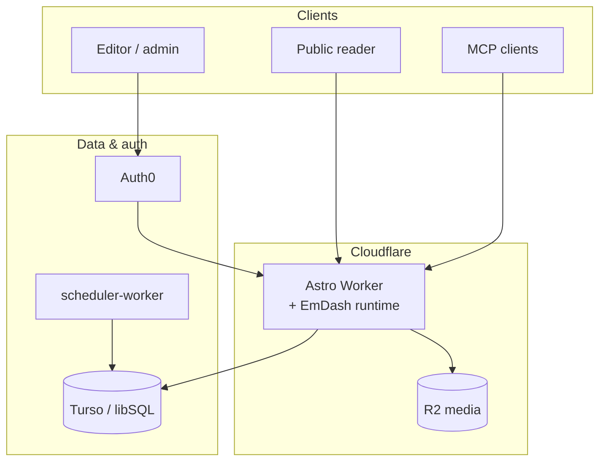

# Freedom Times

A UK/Europe-focused news platform for cult survivors — vetting stories and routing exclusives to established journalists. This repository holds the public site, editorial CMS, mobile shells, and infrastructure-as-code.

**Staging:** [staging.freedomtimes.news](https://staging.freedomtimes.news) · **Production:** [freedomtimes.news](https://freedomtimes.news)

---

## Stack at a glance

| Layer | Technology |
|---|---|
| **Hosting & edge** | Cloudflare Workers (Astro SSR) |
| **CMS & content** | [EmDash](https://emdash.dev) — collections, admin, MCP |
| **Databases** | Turso / libSQL (content, scheduler, subscriptions) |
| **Media** | Cloudflare R2 |
| **Auth** | Auth0 (editor/admin RBAC, cookie sessions) |
| **Mobile** | Capacitor (live-URL wrapper around the web app) |
| **Push** | Web Push (VAPID) via `scheduler-worker` cron |
| **IaC & CI** | Terraform, GitHub Actions, Wrangler |

---

## How it fits together



Readers get server-rendered pages from the Worker. Editors sign in through Auth0; the Worker validates roles and serves EmDash admin and MCP on the same origin. Published content lives in Turso; media in R2. Push notifications are dispatched by a separate cron Worker.

Deeper design: [ARCHITECTURE.md](ARCHITECTURE.md).

---

## Where to go next

### Application development

| Doc | What you'll find |
|---|---|
| [web/README.md](web/README.md) | Astro app — local dev, Wrangler configs, deploy, scheduler |
| [web/docs/ENV_DEV.md](web/docs/ENV_DEV.md) | `.env.dev` + `web/.env` setup, sync scripts, where values come from |
| [LOCAL_DEV_REQUIREMENTS.md](LOCAL_DEV_REQUIREMENTS.md) | Tooling checklist (Git, Terraform, Android SDK, etc.) |
| [web/docs/AUTH.md](web/docs/AUTH.md) | Auth0 routes, cookies, staging login runbook |
| [web/DESIGN_GUIDE.md](web/DESIGN_GUIDE.md) | Visual and layout conventions |

### Content & editorial

| Doc | What you'll find |
|---|---|
| [web/CONTENT_PROMOTION_RUNBOOK.md](web/CONTENT_PROMOTION_RUNBOOK.md) | Staging → production CMS promotion, Turso backups |
| [web/docs/EDITORIAL_ENGLISH_GLOSSES.md](web/docs/EDITORIAL_ENGLISH_GLOSSES.md) | English ledes, French glosses, Portable Text patterns |
| [web/docs/PR_CHECKLIST_EMDASH_CONTENT.md](web/docs/PR_CHECKLIST_EMDASH_CONTENT.md) | Content PR checklist |
| [web/docs/PLAN_EMDASH_CONTENT_FORMAT_AND_MCP_HANDOFF.md](web/docs/PLAN_EMDASH_CONTENT_FORMAT_AND_MCP_HANDOFF.md) | EmDash format, CLI vs MCP |
| [AGENTS.md](AGENTS.md) | Agent/operator rules (MCP-only content access, backups) |

### Infrastructure & operations

| Doc | What you'll find |
|---|---|
| [infra/terraform/README.md](infra/terraform/README.md) | Terraform layout, environments, apply workflow |
| [PRODUCTION_RELEASE_RUNBOOK.md](PRODUCTION_RELEASE_RUNBOOK.md) | Unified production promotion path |
| [ENVIRONMENT_SETUP.md](ENVIRONMENT_SETUP.md) | Environment teardown, secrets sync, CI/CD |
| [SECRET_MANAGEMENT.md](SECRET_MANAGEMENT.md) | Secret handling policy |
| [NON_TERRAFORM_RESOURCES.md](NON_TERRAFORM_RESOURCES.md) | One-time bootstrap outside Terraform |
| [STAGING_RECOVERY.md](STAGING_RECOVERY.md) | Staging environment recovery |
| [scripts/set-github-secrets.md](scripts/set-github-secrets.md) | Syncing Worker secrets after deploy |

### Mobile & push

| Doc | What you'll find |
|---|---|
| [web/docs/ANDROID_CAPACITOR_BUILD.md](web/docs/ANDROID_CAPACITOR_BUILD.md) | Android debug/release builds |
| [web/README.md](web/README.md) § Scheduler Worker | Push subscriptions, VAPID keys, Turso migrations |
| [ARCHITECTURE.md](ARCHITECTURE.md) § 4.9 | Push notification architecture |

### Process

| Doc | What you'll find |
|---|---|
| [DEVELOPMENT_GUARDRAILS.md](DEVELOPMENT_GUARDRAILS.md) | Branch policy, ticket flow, PR rules |

---

## Quick start (local web app)

```powershell
# Repo root — operator secrets (Turso, Terraform, push scripts)
Copy-Item .env.dev.example .env.dev

cd web
npm install
Copy-Item .env.example .env   # Auth0 runtime vars for the dev server
npm run dev
```

`astro.config.ts` needs `TURSO_DATABASE_URL` / `TURSO_AUTH_TOKEN` (from `.env.dev` after Turso sync). Copy them into `web/.env` or run `npx dotenv-cli -e ..\.env.dev -- npm run dev`. Full setup: [web/docs/ENV_DEV.md](web/docs/ENV_DEV.md). Tooling checklist: [LOCAL_DEV_REQUIREMENTS.md](LOCAL_DEV_REQUIREMENTS.md).
