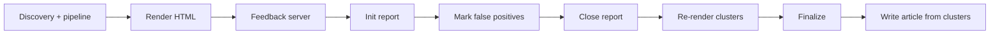

# Weekly run: discovery → digest → review → article

Operator guide for producing a **time-bounded Cult News Digest**, reviewing it in the browser (false positives and clusters), then writing a summary article from the cleaned result.

All commands assume PowerShell and this working directory:

```powershell
cd c:\Users\jonbr\source\repos\freedomtimes\agents\uk-and-europe-cults-columnist
```

Related docs:

- [README.md](../README.md) — agent purpose, discovery policy, env reference
- [SOAK_TEST_HANDOVER.md](../SOAK_TEST_HANDOVER.md) — cache reset, soak-test cadence, diagnostics
- [report-review-notes.md](../report-review-notes.md) — manual notes on recurring false positives / misses

---

## What you are building

| Stage | Output | Used for |
|-------|--------|----------|
| Discovery + pipeline | `reports/last-run-drafts.json`, `reports/drafts-archive.json`, `last-run.log` | Candidate stories that passed the cult filter |
| HTML render | `reports/cult-news-latest.html` | Clustered digest for review |

**Content extraction:** `src/articleContent.ts` isolates headline (og:title), dek (meta description), and article body from publisher chrome before classification and clustering. Re-render after changes to pick up cleaner text.
| Feedback review | `data/feedback/active-report.json` → `data/feedback/false-positives.json` | Remove noise; improve clustering |
| Your article | (CMS / Freedom Times) | One section per **cluster** + picks from **Latest Stories** |

MCP draft creation is still dry-run only (`DRY_RUN=true`). The digest + review loop is the editorial source of truth until CMS wiring is done.

---

## One-time setup

```powershell
npm install
Copy-Item .env.example .env   # if you do not already have .env
```

Required in `.env`:

```dotenv
AGENT_ENV=staging
DRY_RUN=true
DISCOVERY_MAX_AGE_HOURS=168
```

`DISCOVERY_MAX_AGE_HOURS` is the **time window** for discovery (Google News `when:Nh`, feed freshness, etc.). Use `168` for a week, or another positive integer (e.g. `240` for ~10 days).

---

## Set the timeframe (important)

Use the **same** window for discovery and render when writing about a single week. When reviewing over several days, set a **wider render window** so Close Report does not drop older drafts:

| Variable | Role |
|----------|------|
| `DISCOVERY_MAX_AGE_HOURS` | How far back discovery searches (required for `npm run dev`) |
| `CULT_NEWS_RENDER_MAX_AGE_HOURS` | Drops stories older than this at render time (defaults to `DISCOVERY_MAX_AGE_HOURS` if unset). **Close Report re-render uses this** — use `720` (30 days) for multi-day review. |

**Weekly example (7 days, same-day render):**

```powershell
$env:DISCOVERY_MAX_AGE_HOURS = '168'
$env:CULT_NEWS_RENDER_MAX_AGE_HOURS = '168'
```

**Multi-day review (recommended when clusters span 2+ weeks of publication dates):**

```powershell
$env:DISCOVERY_MAX_AGE_HOURS = '168'
$env:CULT_NEWS_RENDER_MAX_AGE_HOURS = '720'
npm run render:html
$env:CULT_NEWS_RENDER_MAX_AGE_HOURS = '720'   # same value before starting server
npm run feedback:server
```

Put `CULT_NEWS_RENDER_MAX_AGE_HOURS=720` in `.env` so `npm run render:html` and the feedback server share the same window.

**Custom window (e.g. 10 days):**

```powershell
$env:DISCOVERY_MAX_AGE_HOURS = '240'
$env:CULT_NEWS_RENDER_MAX_AGE_HOURS = '240'
```

---

## End-to-end workflow



### 0. Optional backup

Before overwriting a good digest:

```powershell
npm run backup:before-run
# or
npm run snapshot:html
```

### 1. Discovery and pipeline

Full run (discover URLs, fetch, classify, write drafts):

```powershell
$env:DISCOVERY_MAX_AGE_HOURS = '168'
npm run dev -- --max=50 --concurrency=8 *>&1 | Tee-Object -FilePath .\last-run.log
```

- `--max=N` — cap how many stories get pipeline approval (omit for unbounded).
- `--concurrency=N` — parallel fetches (default 6 from env).
- `Tee-Object` keeps a full `last-run.log` for the renderer fallback.

**Re-run pipeline only** (no new discovery; uses `reports/last-run-candidates.json`):

```powershell
npm run pipeline:only
```

**Single URL smoke test:**

```powershell
npm run dev -- --url=https://www.example.com/path/to/story *>&1 | Tee-Object -FilePath .\last-run.log
```

Check outputs:

- `reports/last-run-drafts.json` — structured drafts from the latest run
- `reports/drafts-archive.json` — rolling archive (renderer prefers this when present)
- `reports/last-run-candidates.json` — discovered URLs
- `reports/pipeline-rejections-latest.json` — why candidates failed

### 2. Render the digest

```powershell
$env:CULT_NEWS_RENDER_MAX_AGE_HOURS = '168'   # match discovery window
npm run render:html
```

Opens logically as `reports/cult-news-latest.html`. The script:

1. Loads drafts (archive → `last-run-drafts.json` → `last-run.log`)
2. Fetches titles/descriptions/article text
3. Applies freshness filter, dedupe, figurative-cult filter
4. **Clusters** related stories and writes HTML

Console prints cluster labels, e.g. `[cluster] "Scientology" (detected) — 3 stories`.

If you see `No draft stories found`, run step 1 again and confirm `reports/last-run-drafts.json` or the archive has entries.

### 3. Start the feedback server

In a **second terminal** (leave it running):

```powershell
npm run feedback:server
```

Then open **http://localhost:3000** (port override: `$env:FEEDBACK_SERVER_PORT = '3001'`).

The server serves `reports/cult-news-latest.html` and exposes the feedback API. Buttons in the page talk to `window.location.origin`, so you must use the server URL, not `file://`.

### 4. Review: false positives

1. Click **Init Report** (top-right). This creates `data/feedback/active-report.json` in `review` status.
2. For each **non-cult** card, click **False positive**. Entries are stored in the active report (with URL, title, article text, classification audit when available).
3. When finished, click **Close Report**.
   - Merges false positives into `data/feedback/false-positives.json`
   - Re-runs `render-cult-news-html.tsx` using the feedback server’s environment (`CULT_NEWS_RENDER_MAX_AGE_HOURS` — set before starting the server, e.g. `720`)
   - Reloads the page with **updated clusters** (false positives excluded)

### 5. Review: clusters (verification phase)

After close, status becomes **verification**. A cluster editor toolbar appears at the bottom of the page.

- **Rename clusters** — edit the label field in each cluster header.
- **Move stories** — use the “Move to…” dropdown on each card.
- **Wrong cluster** — moves the story to Independent (unsaved until you save).
- **New cluster** / **Dissolve cluster** — toolbar buttons.
- **Save layout & refresh** — writes `data/feedback/cluster-layout.json`, re-renders, and reloads with your layout applied on top of auto-clustering.
- When satisfied, click **Finalize** — archives the report, exports training data, and writes `reports/approved-layout.json` for the writing phase.

To start a new review cycle on the same HTML, click **Init Report** again after finalize.

### 6. Optional: compare before/after render

```powershell
npm run snapshot:html          # copies cult-news-latest.html → cult-news-snapshot.html
# ... review + close report (re-render) ...
npm run diff:html              # compares latest vs snapshot
```

### 7. Write your article

Use the **final** `reports/cult-news-latest.html` (after close report / optional second render):

| Digest section | Article use |
|----------------|-------------|
| **Cluster** blocks (label + multiple articles) | One subsection per theme, e.g. “Scientology in Germany”, “NXIVM follow-up” |
| **Latest Stories** (ungrouped / independent) | Short mentions or “also this week” bullets |
| Card links | Primary sources for attribution |
| Published dates on cards | Confirm they fall inside your `DISCOVERY_MAX_AGE_HOURS` window |
| **Copy citations** (header / per cluster / per card) | Markdown source list with publisher URL + archive mirrors for paywalled pieces |
| `reports/cult-news-sources.json` | Same citation data as JSON (`markdown` field is ready to paste) |

Practical approach:

1. List cluster headings from the console `[cluster]` lines or the HTML group headers.
2. For each cluster, click **Copy citations** on the group header (or use **Copy all source citations** in the digest header).
3. For paywalled outlets, use **Accessible copy for citing** or the `Accessible copy:` line in the pasted markdown — not the publisher URL alone.
4. Write a short narrative per cluster (what happened, who, jurisdiction UK/EU).
5. Add 1–2 sentences on notable independent stories.
6. Keep `report-review-notes.md` updated with systematic false positives to fix in code later.

---

## Feedback files

| File | Purpose |
|------|---------|
| `data/feedback/active-report.json` | In-progress review session (created by **Init Report**) |
| `data/feedback/false-positives.json` | Persistent blocklist; `reason: "false-positive"` excluded on render; `reason: "wrong-cluster"` detached from clusters |
| `data/feedback/cluster-layout.json` | Manual cluster overrides from verification **Save layout & refresh** |
| `data/feedback/archived/<reportId>.json` | Closed review sessions after **Finalize** |
| `data/training-data.jsonl` | One JSON line per finalized entry |
| `reports/approved-layout.json` | Final cluster layout after **Finalize** (writing phase input) |

Manual edit (emergency): add an entry to `false-positives.json`, then re-run `npm run render:html`.

---

## npm scripts (quick reference)

| Command | What it does |
|---------|----------------|
| `npm run dev` | Discovery + pipeline (env from `.env` / `package.json`; set `DISCOVERY_MAX_AGE_HOURS` for window) |
| `npm run pipeline:only` | Pipeline only from `last-run-candidates.json` |
| `npm run render:html` | Build `reports/cult-news-latest.html` and `reports/cult-news-sources.json` |
| `npm run feedback:server` | Review UI at http://localhost:3000 |
| `npm run snapshot:html` | Backup current digest HTML |
| `npm run diff:html` | Diff latest vs snapshot digest |
| `npm run backup:before-run` | Timestamped backup of log, drafts, digest, feedback |
| `npm run sync:cluster-regression` | Snapshot enriched stories (720h window) into `tests/fixtures/cluster-stories-regression.json` |
| `npm run test:clusters` | Regression test auto-clustering against `tests/cluster-expectations.json` |

See [tests/CLUSTER_REGRESSION.md](../tests/CLUSTER_REGRESSION.md) for the clustering test workflow.

---

## Troubleshooting

| Problem | What to do |
|---------|------------|
| Server shows “Report not found” | Run `npm run render:html` first |
| Feedback buttons do nothing | Open via **http://localhost:3000**, not the file path; ensure server is running |
| “Please initialize a report first” | Click **Init Report** |
| Empty digest after a long run | Check `reports/pipeline-rejections-latest.json`; try smaller `--max` first; see SOAK_TEST_HANDOVER for cache issues |
| Stories missing from window | Align `CULT_NEWS_RENDER_MAX_AGE_HOURS` with `DISCOVERY_MAX_AGE_HOURS`; check `publishedAt` on cards |
| Stale clusters after feedback | **Close Report** triggers re-render; or run `npm run render:html` manually |

---

## Suggested weekly checklist

- [ ] Set `DISCOVERY_MAX_AGE_HOURS` (and render hours) for the period you are covering  
- [ ] `npm run backup:before-run` or `snapshot:html` if keeping last week’s digest  
- [ ] `npm run dev` with `Tee-Object` → `last-run.log`  
- [ ] `npm run render:html`  
- [ ] `npm run feedback:server` → review → **Close Report** → check clusters  
- [ ] **Finalize** when blocklist is stable  
- [ ] Optional: `npm run render:html` once more  
- [ ] Draft article from cluster headings + source links  
- [ ] Note recurring mistakes in `report-review-notes.md`
