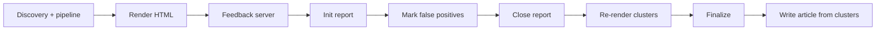

# Weekly run: discovery → digest → review → article

Operator guide for producing a **time-bounded Cult News Digest**, reviewing it in the browser (false positives and clusters), then writing a summary article from the cleaned result.

All commands assume PowerShell and this working directory:

```powershell
cd c:\Users\jonbr\source\repos\freedomtimes\agents\uk-and-europe-cults-columnist
```

Related docs:

- [AGENT_NPM_SCRIPTS.md](AGENT_NPM_SCRIPTS.md) — **canonical index** of every `npm run` script in this package
- [WEEKLY_REPORT_WRITING_GUIDE.md](WEEKLY_REPORT_WRITING_GUIDE.md) — **prose standards** for Europe & UK Cult News roundups
- [CULT_WORDING.md](CULT_WORDING.md) — **using *cult*** in weekly reports (*sect*/*sekt*/*secte*, translation folds)
- [DRAFT_FROM_ARTICLE_PLAN.md](DRAFT_FROM_ARTICLE_PLAN.md) — article plan → draft → images → staging CMS
- [FIELD_RUN_PROMPT.md](FIELD_RUN_PROMPT.md) — **paste into a new agent session**; agent asks for date range, Tor, caps, then runs this workflow
- [README.md](../README.md) — agent purpose, discovery policy, env reference
- [SOAK_TEST_HANDOVER.md](../SOAK_TEST_HANDOVER.md) — cache reset, soak-test cadence, diagnostics
- [tests/CLUSTER_REGRESSION.md](../tests/CLUSTER_REGRESSION.md) — clustering / digest exclusion tests and issue types A/B/C
- [docs/LANGUAGE_FILES.md](LANGUAGE_FILES.md) — figurative phrases, cult terms, when to edit lang JSON
- `report-review-notes.md` (repo root of this agent) — manual notes on recurring false positives / misses (create on first review if missing)

---

## What you are building

| Stage | Output | Used for |
|-------|--------|----------|
| Discovery + pipeline | `reports/last-run-drafts.json`, `reports/drafts-archive.json`, `last-run.log` | Candidate stories that passed the cult filter |
| HTML render | `reports/cult-news-latest.html`, `reports/cult-news-sources.json` | Clustered digest for review |
| Feedback review | `data/feedback/active-report.json` → `data/feedback/false-positives.json` | Remove noise; improve clustering |
| Your article | (CMS / Freedom Times) | One section per **cluster** + picks from **Latest Stories** |

**Content extraction:** `src/articleContent.ts` isolates headline (og:title), dek (meta description), and article body from publisher chrome before classification and clustering. Re-render after code changes to pick up cleaner text.

MCP draft creation is still dry-run only (`DRY_RUN=true`). The digest + review loop is the editorial source of truth until CMS wiring is done.

---

## Two modes: development vs in-the-field

| | **Development / cluster iteration** (pre-field) | **In-the-field weekly report** (production) |
|---|------------------------------------------------|---------------------------------------------|
| **Goal** | Fix clustering, exclusions, regression tests over **days** | Discover once → digest → **human review** → write article |
| **`DISCOVERY_MAX_AGE_HOURS`** | Editorial span (e.g. `181`) | Same editorial span (e.g. `181`) |
| **`CULT_NEWS_RENDER_MAX_AGE_HOURS`** | **`720`** (wider) | **Same as discovery** (e.g. `181`) |
| **Why** | Drafts **age day by day** while you re-render and tune code; wide render keeps early-week stories visible | One pass for this edition; no multi-day cluster engineering |
| **Code changes** | Yes — lang files, aliases, clustering, tests | **No** — editorial review only unless operator explicitly asks |
| **Runbook** | [Refining the code](#refining-the-code-during-the-first-few-weekly-runs) + [CLUSTER_REGRESSION.md](../tests/CLUSTER_REGRESSION.md) | **[FIELD_RUN_PROMPT.md](FIELD_RUN_PROMPT.md)** |

**Pre-field (two clocks):**

```powershell
$env:DISCOVERY_MAX_AGE_HOURS = '181'
$env:CULT_NEWS_RENDER_MAX_AGE_HOURS = '720'
```

**In-the-field (one clock):**

```powershell
$HOURS = '181'
$env:DISCOVERY_MAX_AGE_HOURS = $HOURS
$env:CULT_NEWS_RENDER_MAX_AGE_HOURS = $HOURS
```

Use **`docs/FIELD_RUN_PROMPT.md`** in a new agent session for in-the-field runs.

---

## In-the-field weekly report

Production run for one editorial edition — **not** cluster-logic iteration.

### Pre-flight

```powershell
npm install
npm run test:digest-exclusion:fixture
npm run test:clusters:fixture
```

Optional: `npm run backup:before-run`

### Run

```powershell
$HOURS = '181'   # from editorial start → end
$env:DISCOVERY_MAX_AGE_HOURS = $HOURS
$env:CULT_NEWS_RENDER_MAX_AGE_HOURS = $HOURS

npm run dev -- --max=50 --concurrency=8 *>&1 | Tee-Object -FilePath .\last-run.log
npm run render:html
npm run feedback:server
```

Open **http://localhost:3000** → **Init Report** → false positives → **Close Report** → cluster layout (editorial fixes only) → **Finalize** → write article.

**Do not** during this run: `sync:cluster-regression`, clustering code changes, or regression-test updates — unless you explicitly switch back to development mode.

---

## First field run: past week (168 hours)

Legacy heading — see **[In-the-field weekly report](#in-the-field-weekly-report)** above. Use computed hours (e.g. **181** for 31 May – 7 June), not a fixed `168`.

## Refining the code (development mode only)

Use this when **iterating on cluster logic and tests pre-field** — not during an in-the-field weekly report.

Expect **2–4 development cycles** with **two clocks** (`DISCOVERY_MAX_AGE_HOURS` = editorial span, `CULT_NEWS_RENDER_MAX_AGE_HOURS` = **`720`**) so the same draft corpus stays visible while stories age and you re-render over several days.

### 1. Capture issues while reviewing

During feedback review, note each problem in `report-review-notes.md`:

- URL or title pattern
- **Issue type** (see below)
- Whether it should be **excluded from digest**, **clustered differently**, or **discovered but missing**

Do not jump straight to `false-positives.json` for systematic mistakes; fix the pipeline or lang files so the next render is better for everyone.

### 2. Classify the issue

| Type | Symptom | Primary fix surface |
|------|---------|---------------------|
| **A — Mis-clustering** | Wrong cluster (weak bridge, e.g. MTG vs Ahmadi raid) | Clustering logic in `render-cult-news-html.tsx`, `subject-aliases.json`, `tests/cluster-expectations.json` |
| **B — Digest false positive** | Should not appear in HTML at all (figurative cult, homograph host, entertainment) | `data/excluded-source-hosts.json`, `data/discovery/lang/*.json`, `tests/digest-exclusion-expectations.json` |
| **C — Missing cluster** | Same real-world subject, multiple languages, not grouped | `data/subject-aliases.json`, `expectedClusters` in `tests/cluster-expectations.json` |

See [tests/CLUSTER_REGRESSION.md](../tests/CLUSTER_REGRESSION.md) for the full scenario map.

### 3. Fix priority (signal-based, not article-specific)

**False positives in digest (type B)**

1. **Homograph / wrong site** — add host to `data/excluded-source-hosts.json` (e.g. `fotocult.it` photography, not cult news).
2. **Figurative “cult”** — add phrase to `figurativeCultPhrases` in the right `data/discovery/lang/<code>.json` (see [LANGUAGE_FILES.md](LANGUAGE_FILES.md)).
3. **Figurative genre language but story *is* about cults** — do **not** remove phrases like `cult thriller` globally. The pipeline keeps these via `hasSubstantiveCultSubjectMatter()` when the body has repeated cult coverage, coercive-harm terms near cult language, or news-style preposition patterns (e.g. Unchosen Netflix reviews, real cult documentaries). Add a **`mustIncludeFromDigest`** case in `tests/digest-exclusion-expectations.json` if regressions are likely.
4. **Avoid** broad context terms that suppress real coverage (e.g. do not add `netflix` / `binge` as figurative context terms — Netflix publishes cult documentaries and syndicated reviews).
5. **Media/entertainment profile** — `mediaSignals` in lang files (soap opera, radio drama, etc.), not publisher names alone.

**Missing or wrong clusters (types A / C)**

1. Add or extend **`data/subject-aliases.json`** (`matchMode: "aliasOnly"` when a generic alias appears in unrelated bodies).
2. Adjust clustering only when alias + title grounding is insufficient; keep Unchosen (fiction) **separate** from PBCC (real group news) — tests enforce this.
3. Update **`tests/cluster-expectations.json`** (`expectedClusters`, `mustNotShareCluster`, `forbiddenMegaClusters`).

**Discovery misses (story never in drafts)**

1. Check `reports/pipeline-rejections-latest.json` and classification audit on the card (if it reached render once).
2. Tune discovery via `DISCOVERY_FOCUS_JSON`, watchlist hosts, or locale caps — not hardcoded URLs in TypeScript.

### 4. Lock in with regression tests

After each code/config fix:

```powershell
npm run test:digest-exclusion:fixture    # fast — exclusion + inclusion snippets
npm run test:clusters:fixture              # fast — frozen corpus

# After changing drafts corpus or render window intentionally:
npm run sync:cluster-regression
npm run test:clusters                      # live — same story set as render:html
npm run test:digest-exclusion              # live — false positives absent from corpus
```

Add scenarios to:

- `tests/digest-exclusion-expectations.json` — `mustExcludeFromDigest` / `mustIncludeFromDigest`
- `tests/fixtures/digest-exclusion-snippets.json` — minimal snippets (no HTTP) for new cases
- `tests/cluster-expectations.json` — cluster and separation contracts

Draft new cluster expectations from current output:

```powershell
npm run cluster:print-expectations -- --write
# merge tests/cluster-expectations.draft.json into cluster-expectations.json
```

### 5. When to use `false-positives.json`

Use the feedback UI (**False positive** → **Close Report**) or manual JSON **only** for one-off edge cases after programmatic fixes are exhausted. Persistent patterns belong in lang files, excluded hosts, or subject aliases so the next weekly run starts clean.

### 6. Known live-test caveat

`npm run test:clusters` may fail on **`konstantin-rudnev`** when `europeantimes.news` is on the excluded-hosts list — one story is digest-excluded, so the pair cannot auto-cluster in the **live** corpus. The **fixture** test still passes (both stories in the snapshot). This is expected unless you remove that host from the blocklist deliberately.

---

## One-time setup

```powershell
npm install
Copy-Item .env.example .env   # if you do not already have .env
```

Required in `.env`:

```dotenv
AGENT_ENV=staging
DRY_RUN=true
DISCOVERY_MAX_AGE_HOURS=181
```

Set `CULT_NEWS_RENDER_MAX_AGE_HOURS` only if you need an explicit value; otherwise render uses `DISCOVERY_MAX_AGE_HOURS`.

`DISCOVERY_MAX_AGE_HOURS` is the **time window** for discovery (Google News `when:Nh`, feed freshness, etc.). Compute it from your editorial dates (see below), not a fixed `168`.

---

## Set the timeframe

How you set the clocks depends on **mode** (see [Two modes](#two-modes-development-vs-in-the-field)).

| Variable | When it applies | What it measures |
|----------|-----------------|------------------|
| **`DISCOVERY_MAX_AGE_HOURS`** | `npm run dev` | How far back to **search** for new URLs (Google News `when:Nh`). |
| **`CULT_NEWS_RENDER_MAX_AGE_HOURS`** | `render:html`, **Close Report** | At **each render**, drop drafts whose **`publishedAt` is more than N hours before `Date.now()`**. |

Neither variable is a “review session timer.” Render age is always measured from **when the HTML is built**.

### Compute editorial hours

```text
EDITORIAL_HOURS = ceil(hours from editorial start UTC to editorial end UTC)
```

**Example:** `2026-05-31 00:00 UTC` → `2026-06-07 13:00 UTC` = **181 hours**

| Mode | `DISCOVERY_MAX_AGE_HOURS` | `CULT_NEWS_RENDER_MAX_AGE_HOURS` |
|------|---------------------------|----------------------------------|
| **Development / cluster iteration** | `EDITORIAL_HOURS` (e.g. `181`) | **`720`** — keeps aging drafts in digest while you work on code over days |
| **In-the-field weekly report** | `EDITORIAL_HOURS` (e.g. `181`) | **`EDITORIAL_HOURS`** (same) — one edition, one pass |

Before **Close Report** / **feedback:server**, the server must use the same `CULT_NEWS_RENDER_MAX_AGE_HOURS` as your last `render:html`.

**Article scope:** When writing, only cite stories whose **published** dates fall inside your editorial start/end.

### In-the-field example (31 May – 7 June)

```powershell
$HOURS = '181'
$env:DISCOVERY_MAX_AGE_HOURS = $HOURS
$env:CULT_NEWS_RENDER_MAX_AGE_HOURS = $HOURS
npm run dev -- --max=50 --concurrency=8 *>&1 | Tee-Object -FilePath .\last-run.log
npm run render:html
$env:CULT_NEWS_RENDER_MAX_AGE_HOURS = $HOURS
npm run feedback:server
```

### Development example (same editorial week, multi-day cluster work)

```powershell
$env:DISCOVERY_MAX_AGE_HOURS = '181'
$env:CULT_NEWS_RENDER_MAX_AGE_HOURS = '720'
npm run render:html
# … edit clustering / lang files …
npm run test:clusters
npm run sync:cluster-regression   # when corpus intentionally changes
```

---

## End-to-end workflow



### 0. Optional backup

Before overwriting a good digest:

```powershell
npm run backup:before-run
# or
npm run snapshot:html
```

### 1. Discovery and pipeline

Full run (discover URLs, fetch, classify, write drafts):

```powershell
$env:DISCOVERY_MAX_AGE_HOURS = '168'
npm run dev -- --max=50 --concurrency=8 *>&1 | Tee-Object -FilePath .\last-run.log
```

- `--max=N` — cap how many stories get pipeline approval (omit for unbounded; use a cap on first runs to control runtime).
- `--concurrency=N` — parallel fetches (default 6 from env).
- `Tee-Object` keeps a full `last-run.log` for the renderer fallback.

**Re-run pipeline only** (no new discovery; uses `reports/last-run-candidates.json`):

```powershell
npm run pipeline:only
```

**Single URL smoke test:**

```powershell
npm run dev -- --url=https://www.example.com/path/to/story *>&1 | Tee-Object -FilePath .\last-run.log
```

Check outputs:

- `reports/last-run-drafts.json` — structured drafts from the latest run
- `reports/drafts-archive.json` — rolling archive (renderer prefers this when present)
- `reports/last-run-candidates.json` — discovered URLs
- `reports/pipeline-rejections-latest.json` — why candidates failed

### 2. Render the digest

```powershell
$env:CULT_NEWS_RENDER_MAX_AGE_HOURS = $env:DISCOVERY_MAX_AGE_HOURS   # same as discovery
npm run render:html
```

Opens logically as `reports/cult-news-latest.html`. The script:

1. Loads drafts (archive → `last-run-drafts.json` → `last-run.log`)
2. Fetches titles/descriptions/article text (HTTP cache)
3. Applies freshness filter, dedupe, figurative-cult filter (with substantive-cult override), excluded hosts
4. **Clusters** related stories and writes HTML

Console prints cluster labels, e.g. `[cluster] "Scientology" (detected) — 3 stories`, and exclusion counts by reason.

If you see `No draft stories found`, run step 1 again and confirm `reports/last-run-drafts.json` or the archive has entries.

### 3. Start the feedback server

In a **second terminal** (leave it running):

```powershell
npm run feedback:server
```

Then open **http://localhost:3000** (port override: `$env:FEEDBACK_SERVER_PORT = '3001'`).

The server serves `reports/cult-news-latest.html` and exposes the feedback API. Buttons in the page talk to `window.location.origin`, so you must use the server URL, not `file://`.

### 4. Review: false positives

1. Click **Init Report** (top-right). This creates `data/feedback/active-report.json` in `review` status.
2. For each **non-cult** card, click **False positive**. Entries are stored in the active report (with URL, title, article text, classification audit when available).
3. When finished, click **Close Report**.
   - Merges false positives into `data/feedback/false-positives.json`
   - Re-runs `render-cult-news-html.tsx` using the feedback server’s environment — **`CULT_NEWS_RENDER_MAX_AGE_HOURS` must match discovery** (set before starting the server)
   - Reloads the page with **updated clusters** (false positives excluded)

### 5. Review: clusters (verification phase)

After close, status becomes **verification**. A cluster editor toolbar appears at the bottom of the page.

- **Rename clusters** — edit the label field in each cluster header.
- **Move stories** — use the “Move to…” dropdown on each card.
- **Wrong cluster** — moves the story to Independent (unsaved until you save).
- **New cluster** / **Dissolve cluster** — toolbar buttons.
- **Save layout & refresh** — writes `data/feedback/cluster-layout.json`, re-renders, and reloads with your layout applied on top of auto-clustering.
- When satisfied, click **Finalize** — archives the report, exports training data, and writes `reports/approved-layout.json` for the writing phase.

To start a new review cycle on the same HTML, click **Init Report** again after finalize.

### 6. Optional: compare before/after render

```powershell
npm run snapshot:html          # copies cult-news-latest.html → cult-news-snapshot.html
# ... review + close report (re-render) ...
npm run diff:html              # compares latest vs snapshot
```

### 7. Write your article

**Prose standards:** [WEEKLY_REPORT_WRITING_GUIDE.md](WEEKLY_REPORT_WRITING_GUIDE.md) — title (`Europe & UK Cult News: …`), 2–3 paragraphs per unit, no bold, no em dashes or AI filler, redundancy cuts, Beyond Europe, citations. **Cult wording:** [CULT_WORDING.md](CULT_WORDING.md).

Use the **final** `reports/cult-news-latest.html` (after close report / optional second render):

| Digest section | Article use |
|----------------|-------------|
| **Cluster** blocks (label + multiple articles) | One `##` section per cluster — synthesise all URLs in the unit |
| **Latest Stories** (ungrouped / independent) | One `##` section each (or grouped per article plan) |
| Card links | Primary sources for attribution |
| Published dates on cards | Confirm they fall inside your editorial window |
| **Copy citations** (header / per cluster / per card) | Markdown source list with publisher URL + archive mirrors for paywalled pieces |
| `reports/cult-news-sources.json` | Same citation data as JSON (`markdown` field is ready to paste) |

Practical approach:

1. Finalize article plan at http://localhost:3000/articles → `reports/article-plan.json`.
2. Walk `unitIds` in order; each unit → one roundup section (see writing guide).
3. Lead each section with **who / what / where / when** from Tier A/B sources; name defendants and charges when outlets do.
4. **2–3 short paragraphs** per unit — cut orphan procedural lines, repeated facts, and meta “paper does not report” filler (writing guide § Cut redundancy).
5. **No Freedom Times commentary** in body — report sources; default to *cult* ([CULT_WORDING.md](CULT_WORDING.md)).
6. One brief preamble after the title; `## Beyond Europe` for out-of-region events reported on European outlets.
7. Foreign-language direct quotes: **translation blocks** (original `>` blockquote + `<details class="translate">`) — not inline English paraphrase (writing guide § Translation blocks).
8. End with `## Source citations` in Freedom Times format; paywalled labels and verified archive links.
8. Keep `report-review-notes.md` updated with systematic false positives to fix in code before the next weekly run.

Draft → images → staging: [DRAFT_FROM_ARTICLE_PLAN.md](DRAFT_FROM_ARTICLE_PLAN.md).

---

## Feedback files

| File | Purpose |
|------|---------|
| `data/feedback/active-report.json` | In-progress review session (created by **Init Report**) |
| `data/feedback/false-positives.json` | Persistent blocklist; `reason: "false-positive"` excluded on render; `reason: "wrong-cluster"` detached from clusters |
| `data/feedback/cluster-layout.json` | Manual cluster overrides from verification **Save layout & refresh** |
| `data/feedback/archived/<reportId>.json` | Closed review sessions after **Finalize** |
| `data/training-data.jsonl` | One JSON line per finalized entry |
| `reports/approved-layout.json` | Final cluster layout after **Finalize** (writing phase input) |

Manual edit (emergency): add an entry to `false-positives.json`, then re-run `npm run render:html`.

---

## npm scripts (quick reference)

| Command | What it does |
|---------|----------------|
| `npm run dev` | Discovery + pipeline (env from `.env` / shell; set `DISCOVERY_MAX_AGE_HOURS` for window) |
| `npm run pipeline:only` | Pipeline only from `last-run-candidates.json` |
| `npm run render:html` | Build `reports/cult-news-latest.html` and `reports/cult-news-sources.json` |
| `npm run feedback:server` | Review UI at http://localhost:3000 |
| `npm run snapshot:html` | Backup current digest HTML |
| `npm run diff:html` | Diff latest vs snapshot digest |
| `npm run backup:before-run` | Timestamped backup of log, drafts, digest, feedback |
| `npm run sync:cluster-regression` | Snapshot enriched stories (720h window) into `tests/fixtures/cluster-stories-regression.json` |
| `npm run test:clusters` | Live regression — auto-clustering on current render corpus |
| `npm run test:clusters:fixture` | Offline regression — frozen fixture only |
| `npm run test:digest-exclusion` | Live — exclusion + inclusion checks on render corpus |
| `npm run test:digest-exclusion:fixture` | Offline — snippet/fixture checks only |
| `npm run cluster:print-expectations -- --write` | Draft `cluster-expectations.draft.json` from current clusters |

Config/data paths worth knowing:

| Path | Purpose |
|------|---------|
| `data/excluded-source-hosts.json` | Hosts never shown in digest |
| `data/subject-aliases.json` | Named groups for clustering |
| `data/discovery/lang/*.json` | Figurative phrases, cult terms, media signals |
| `tests/cluster-expectations.json` | Cluster regression contract |
| `tests/digest-exclusion-expectations.json` | Digest exclusion / inclusion contract |

---

## Troubleshooting

| Problem | What to do |
|---------|------------|
| Server shows “Report not found” | Run `npm run render:html` first |
| Feedback buttons do nothing | Open via **http://localhost:3000**, not the file path; ensure server is running |
| “Please initialize a report first” | Click **Init Report** |
| Empty digest after a long run | Check `reports/pipeline-rejections-latest.json`; try smaller `--max` first; see SOAK_TEST_HANDOVER for cache issues |
| Stories missing from window | **Field:** discovery and render same hours; finish review soon after discovery. **Dev:** use render `720` while iterating |
| Stale clusters after feedback | **Close Report** triggers re-render; or run `npm run render:html` manually |
| Real cult doc excluded as “figurative” | Body may need more cult-subject signal; check substantive override; add `mustIncludeFromDigest` test |
| Same subject not clustering | Add `subject-aliases.json` entry; run `test:clusters:fixture` |
| `test:clusters` fails only on Rudnev live | Expected if `europeantimes.news` is excluded — see **Known live-test caveat** above |

---

## Suggested checklists

### In-the-field weekly report

- [ ] Compute `EDITORIAL_HOURS`; set **both** discovery and render to that value  
- [ ] Optional: fixture tests green (`test:digest-exclusion:fixture`, `test:clusters:fixture`)  
- [ ] `npm run backup:before-run` if keeping last digest  
- [ ] `npm run dev` → `render:html` → `feedback:server`  
- [ ] Browser: Init Report → false positives → Close Report → layout → Finalize  
- [ ] Write article from clusters + `cult-news-sources.json`  
- [ ] **No** cluster code changes or `sync:cluster-regression` unless switching to dev mode  

### Development / cluster iteration (pre-field)

- [ ] `DISCOVERY_MAX_AGE_HOURS` = editorial span; **`CULT_NEWS_RENDER_MAX_AGE_HOURS=720`**  
- [ ] Log issues in `report-review-notes.md` (types A / B / C)  
- [ ] Fix via lang files / excluded hosts / subject aliases — not one-off render hacks  
- [ ] `npm run sync:cluster-regression` when corpus changes intentionally  
- [ ] `npm run test:clusters` and `npm run test:digest-exclusion` before merging code  
- [ ] Commit fixture + expectation updates with the code change  
